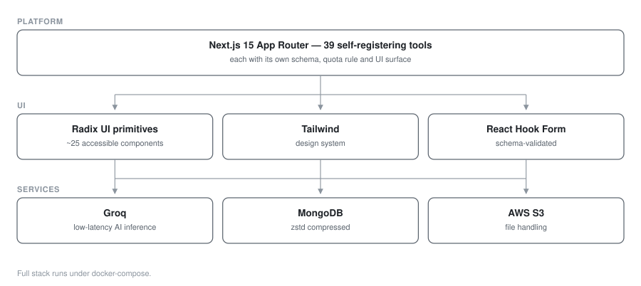

# ToolifyHub — 39-Tool SaaS Platform

**SaaS platform · Next.js 15 · 39 tools**

One platform hosting 39 separate utilities behind a single account, quota and billing system, with AI features running on Groq for low-latency inference.

> **Source code is private.** This repository documents the architecture and engineering work.

## My role
Full-stack engineer — platform architecture, tool plugin model, AI integration and deployment.

## Architecture

| Component | Stack |
|---|---|
| Platform | Next.js 15, App Router, TypeScript |
| UI | Radix UI primitives, Tailwind, shadcn-style components |
| Data | MongoDB (with zstd compression) |
| AI | Groq inference API |
| Storage | AWS S3 |
| Admin | React + Vite dashboard (separate SPA) |
| Deploy | Docker + docker-compose |

### Service topology

## Engineering highlights

**Plugin-shaped tool model.** Each of the 39 tools is a self-registering unit with its own schema, quota rule and UI surface, so adding a tool is additive rather than a change to shared routing — the difference between a platform and 39 pages.

**Accessible component layer.** Built on ~25 Radix UI primitives (dialog, dropdown, popover, menubar, accordion, context menu and more) rather than a pre-built kit, giving correct keyboard and screen-reader behaviour with full visual control.

**AI features on Groq.** Groq's inference API for low-latency AI-assisted tools — chosen over heavier providers specifically for response time on interactive tools.

**Type-safe forms.** React Hook Form with resolver-based schema validation shared between client and server.

**Storage efficiency.** MongoDB with zstd compression and AWS SDK credential providers for S3-backed file handling.

**Containerised.** Full docker-compose stack for reproducible local and production environments.

## Screenshots

<!--  -->
<!--  -->
<!--  -->

_Screenshots pending — see `docs/README.md`._

## Stack

`Next.js 15` · `TypeScript` · `React` · `Radix UI` · `Tailwind` · `MongoDB` · `Groq AI` · `AWS S3` · `Docker` · `Vite`
